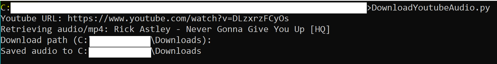

# YoutubeAudioDownloader
Downloads the highest bitrate audio from Youtube

## Usage
Requires Python 3.10.0+ to be installed

Within a Windows/Mac/Linux terminal, run the command `python DownloadYoutubeAudio.py`. The program will prompt the user to input a valid YouTube URL and specify the download path if desired.

By default, Youtube audio tends to have the format `.mp4`. Most systems should allow users to rename the file extension as `.mp3` without affecting the ability to play audio.
